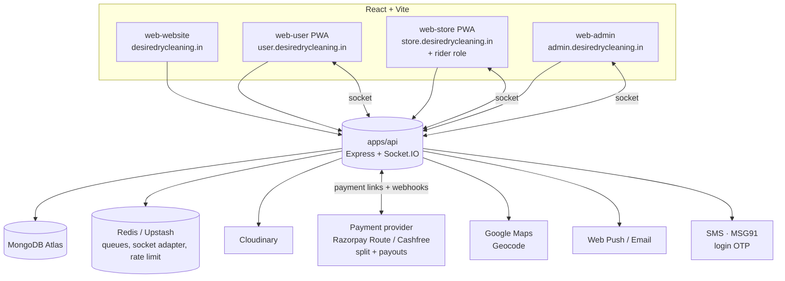
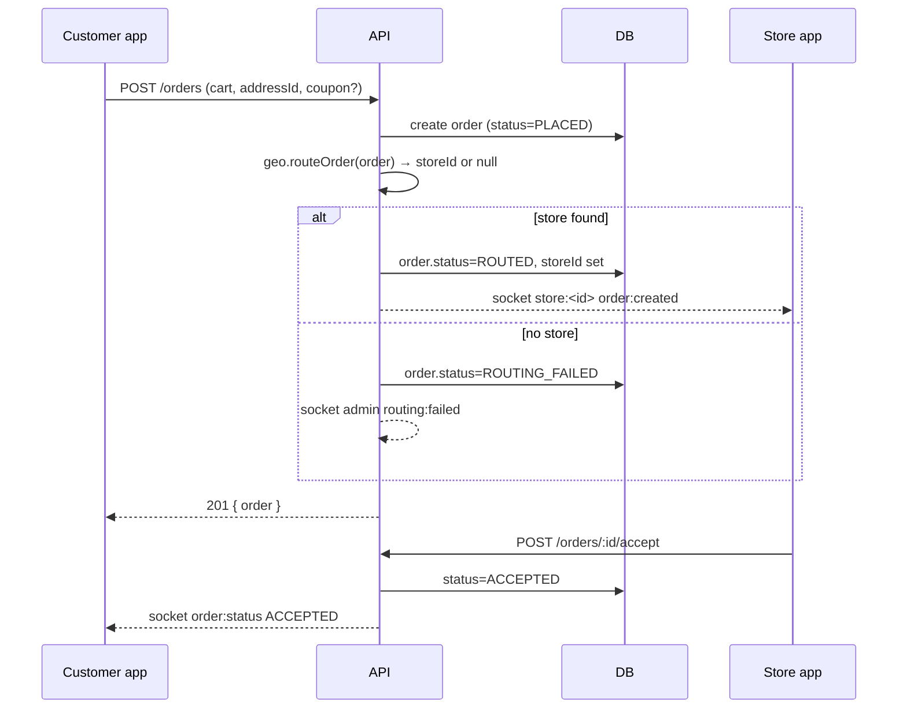

# 03 — Architecture

## 3.1 High-level

One **Node/Express API** and one **MongoDB Atlas** database serve four independent React
frontends. Realtime updates flow over **Socket.IO**. Background work (notifications, routing
retries, **settlement close**, refunds) runs on **BullMQ + Redis**. Media goes to
**Cloudinary**. Payments + **per-store split settlement** go through a **provider adapter**
(Razorpay Route by default). **SMS** (MSG91) sends phone-login OTPs — on the critical auth
path.



## 3.2 Why this shape

- **One backend, one DB** — the client explicitly wants a common backend and common
  database. Shared order/user/store data with no cross-service sync.
- **Four separate frontends** — different audiences, different install/SEO needs, independent
  deploys, smaller bundles. They share code through `packages/`.
- **Rider = role, not app** (ADR-0004) — riders are created by stores and only ever act in
  the store's context; a role inside `web-store` avoids a fifth deploy and a separate auth
  surface.

## 3.3 Monorepo

```
ddc/
├── apps/
│   ├── api/
│   ├── web-website/
│   ├── web-user/
│   ├── web-store/
│   └── web-admin/
├── packages/
│   ├── shared/     # types, Zod schemas, enums, ORDER_STATE_MACHINE, constants, money utils
│   ├── ui/         # shared React components, Tailwind preset, design tokens
│   └── config/     # eslint-config, tsconfig base, prettier config
├── turbo.json
├── pnpm-workspace.yaml
└── package.json
```

- **pnpm workspaces** for linking; **Turborepo** for task graph + caching (`dev`, `build`,
  `lint`, `test`).
- `packages/shared` is the **contract**. Example exports: `Role`, `OrderStatus`,
  `PaymentStatus`, `TicketStatus`, `ServiceUnit`, `zPlaceOrder`, `zCreateInvoice`,
  `orderReducer(state, event)`, `toPaise`, `formatMoney`.
- Frontends never import from `apps/api`; both sides import from `packages/shared`.

## 3.4 Backend internals

```
apps/api/src/
├── modules/<feature>/         # auth, users, stores, riders, services, orders, invoicing,
│   ├── <feature>.routes.ts    # payments, coupons, tickets, notifications, geo, analytics
│   ├── <feature>.controller.ts
│   ├── <feature>.service.ts   # business logic; the only place that mutates its models
│   ├── <feature>.model.ts     # Mongoose schema
│   └── <feature>.test.ts
├── middleware/
│   ├── authenticate.ts        # verifies access token, attaches req.user
│   ├── authorize.ts           # authorize(...roles) / authorize.permission(...)
│   ├── validate.ts            # validate(zodSchema) for body/query/params
│   ├── rateLimit.ts
│   └── errorHandler.ts        # maps errors → { ok:false, error:{code,message,details} }
├── lib/
│   ├── db.ts  redis.ts  socket.ts  logger.ts  cloudinary.ts  config.ts  maps.ts
├── jobs/
│   ├── queue.ts               # BullMQ setup (or in-process fallback)
│   └── workers/               # notification.worker.ts, routing.worker.ts, payout.worker.ts
└── index.ts                   # express app + socket server bootstrap
```

Rules:
- Controllers are thin: validate → call service → shape response.
- Services own transactions and emit socket events + enqueue jobs.
- Cross-module calls go **service → service**, never controller → model of another module.
- All order status changes go through `orders.service.transition(orderId, event, actor)`
  which delegates to `orderReducer` from `packages/shared`.

## 3.5 Frontend internals (same skeleton for all four)

```
apps/web-*/src/
├── main.tsx  app.tsx  routes.tsx
├── lib/         apiClient.ts (fetch wrapper, refresh handling), socket.ts, queryClient.ts
├── features/<feature>/   components, hooks (useOrders, usePlaceOrder), api.ts
├── components/  shared UI (from packages/ui + local)
├── stores/      zustand slices (auth, cart, ui)
└── pwa/         (web-user, web-store only) registerSW.ts, push.ts
```

- **Server state** → TanStack Query (keyed by resource). **Client/UI state** → Zustand.
- One `apiClient` handles the access-token header and silent refresh on 401.
- Socket events invalidate the relevant Query keys (e.g. `['order', id]`).

## 3.6 Realtime (Socket.IO)

- Client connects after auth; server authenticates the socket with the access token.
- **Rooms:** `user:<userId>`, `store:<storeId>`, `rider:<riderId>`, `admin`.
- **Server → client events:** `order:created`, `order:updated`, `order:status`,
  `payment:updated`, `ticket:updated`, `rider:assigned`, `routing:failed` (admin room).
- Payloads are minimal (`{ orderId, status }`); clients refetch detail via the API.
- Production: Socket.IO **Redis adapter** so multiple API instances share rooms.
- Fallback: if the socket drops, Query `refetchOnWindowFocus` + polling on the order-detail
  screen keeps status fresh.

## 3.7 Environments

| Env | API | DB | Frontends |
|---|---|---|---|
| Local | `localhost:4000` | Atlas dev cluster (or local mongo) | Vite dev servers 5173–5176 |
| Preview | Render preview / branch | Atlas dev cluster, per-branch DB name | Vercel preview URLs |
| Production | Render service | Atlas prod cluster | Vercel prod, custom subdomains |

Config strictly from env vars (`docs/16`, `docs/18`). No environment branching in code
beyond `NODE_ENV`.

## 3.8 Key flows (sequence)

### Place order → route → accept


### Pickup with OTP
```mermaid
sequenceDiagram
  participant St as Store app
  participant API
  participant C as Customer app
  participant Ri as Rider (store app)
  St->>API: POST /orders/:id/assign-pickup { riderId }
  API-->>C: socket rider:assigned (name, photo, vehicle, otp shown in app)
  API-->>Ri: socket order:updated (job appears)
  Ri->>API: POST /orders/:id/pickup/verify-otp { otp }
  API->>API: compare hash; status=PICKED_UP
  API-->>C: socket order:status PICKED_UP (hide OTP)
```

### Invoice + payment
```mermaid
sequenceDiagram
  participant St as Store app
  participant API
  participant PAY as Cashfree
  participant C as Customer app
  St->>API: POST /orders/:id/invoice (line items, tax, discount)
  API->>PAY: create payment link (amount, orderRef)
  PAY-->>API: link url + id
  API->>DB: invoice + payment(status=PENDING, linkUrl)
  API-->>C: socket order:status INVOICED (view + pay)
  C->>PAY: pays via link
  PAY-->>API: webhook payment.success (signed)
  API->>API: verify signature; payment.status=PAID (idempotent)
  API-->>C: socket payment:updated PAID
  API-->>St: socket payment:updated PAID
```
