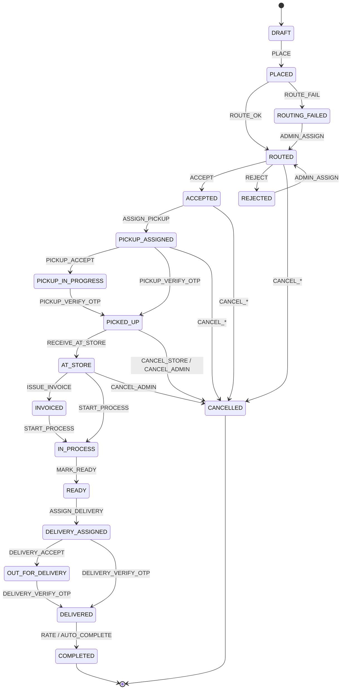

# 06 — Order Lifecycle

The order state machine is the heart of the system. It is defined **once** in
`packages/shared` as `ORDER_STATE_MACHINE` + `orderReducer(state, event)` and enforced by
`orders.service.transition()`. No code sets `order.status` directly.

## 6.1 States

| Status | Meaning | Who moves it out |
|---|---|---|
| `DRAFT` | In the cart, not yet an order row | Customer (place) |
| `PLACED` | Submitted by the customer | System (routing) |
| `ROUTED` | Auto-assigned to a store | Store (accept/reject) |
| `ROUTING_FAILED` | No store matched the address | Admin (manual assign) |
| `ACCEPTED` | Store took the order | Store (assign pickup) |
| `REJECTED` | Store declined | Admin (requeue) — else terminal |
| `PICKUP_ASSIGNED` | Pickup rider set, pickup OTP issued | Rider |
| `PICKUP_IN_PROGRESS` | Rider accepted / en route | Rider |
| `PICKED_UP` | Pickup OTP verified by rider | Store (receive) |
| `AT_STORE` | Garments received & verified at store | Store (invoice) |
| `INVOICED` | Binding invoice issued + payment link sent | Store (start processing) |
| `IN_PROCESS` | Cleaning underway | Store (mark ready) |
| `READY` | Cleaning done, awaiting delivery | Store (assign delivery) |
| `DELIVERY_ASSIGNED` | Delivery rider set, delivery OTP issued | Rider |
| `OUT_FOR_DELIVERY` | Rider en route to customer | Rider |
| `DELIVERED` | Delivery OTP verified **and** payment complete | System / customer (rating) |
| `COMPLETED` | Customer rated, or auto-closed after N hours | — (terminal) |
| `CANCELLED` | Cancelled by customer / store / admin | — (terminal) |

## 6.2 Transition table

`event` → allowed `from` states → resulting `to` state · guard · side effects.

| Event | From | To | Guard | Side effects |
|---|---|---|---|---|
| `PLACE` | DRAFT | PLACED | valid cart, address, coupon ok, **`paymentMode` set**, **pickup slot valid & has capacity** for the preview store | create order row + `ref`; snapshot items/address; store `paymentMode` + `pickup.slot` (+ resolve `pickup.scheduledAt`); compute estimate; redeem-lock coupon; enqueue `ROUTE` |
| `ROUTE_OK` | PLACED | ROUTED | store resolved & APPROVED & open | set `storeId`, `routing.method`; socket `order:created` → store & admin; push to store |
| `ROUTE_FAIL` | PLACED | ROUTING_FAILED | no store / all closed | socket `routing:failed` → admin; notify customer "finding a store" |
| `ADMIN_ASSIGN` | ROUTING_FAILED, REJECTED | ROUTED | admin picks store | set `storeId`, `routing.method=MANUAL`, `assignedByUserId`; notify store |
| `ACCEPT` | ROUTED | ACCEPTED | actor is that store; store APPROVED | notify customer; socket `order:status` |
| `REJECT` | ROUTED | REJECTED | reason provided | notify admin (requeue candidate); socket to admin |
| `ASSIGN_PICKUP` | ACCEPTED, PICKUP_ASSIGNED | PICKUP_ASSIGNED | rider belongs to store & active | generate **pickup OTP** (hash + expiry); reveal OTP in customer app; notify customer (rider card) + rider (`rider:assigned`) |
| `PICKUP_ACCEPT` | PICKUP_ASSIGNED | PICKUP_IN_PROGRESS | actor = assigned rider | set `pickup.jobStatus=ACCEPTED` |
| `PICKUP_VERIFY_OTP` | PICKUP_ASSIGNED, PICKUP_IN_PROGRESS | PICKED_UP | OTP matches hash & not expired | `pickup.verifiedAt`; hide OTP; notify customer & store; optional garment photos attached |
| `RECEIVE_AT_STORE` | PICKED_UP | AT_STORE | actor = store | write per-item `verifiedQty`/`finalUnitPrice`/photos; notify customer "items received" |
| `ISSUE_INVOICE` | AT_STORE, INVOICED | INVOICED | invoice has ≥1 line, total > 0 | create/replace invoice; **if `paymentMode=ONLINE`** create a split payment link (store linked account + platform commission) via provider, `paymentStatus=PENDING`; **if `paymentMode=COD`** no link, `paymentStatus=PENDING` (amount due on delivery); notify customer (view + pay / view amount) + email invoice |
| `START_PROCESS` | INVOICED, AT_STORE | IN_PROCESS | (payment not required to start) | compute `delivery.promisedAt` = `pickup.scheduledAt` + `store.sla` turnaround (per-category max, else `defaultTurnaroundHours`); notify customer "in process" + promised time |
| `MARK_READY` | IN_PROCESS | READY | – | confirm/adjust `delivery.promisedAt`; notify customer |
| `ASSIGN_DELIVERY` | READY, DELIVERY_ASSIGNED | DELIVERY_ASSIGNED | rider belongs to store & active | generate **delivery OTP**; reveal in customer app; notify customer + rider |
| `DELIVERY_ACCEPT` | DELIVERY_ASSIGNED | OUT_FOR_DELIVERY | actor = assigned rider | `delivery.jobStatus=ACCEPTED` |
| `MARK_COD_COLLECTED` | OUT_FOR_DELIVERY, DELIVERY_ASSIGNED | (no status change) | `paymentMode=COD`; actor = assigned rider or store | `payment.method='cod'`, `paymentStatus=PAID`, `order.codCollectedAt`; socket `payment:updated` |
| `DELIVERY_VERIFY_OTP` | DELIVERY_ASSIGNED, OUT_FOR_DELIVERY | DELIVERED | OTP valid **AND** `paymentStatus=PAID` (online: gateway webhook; COD: `MARK_COD_COLLECTED` done) | `delivery.verifiedAt`; invoice `PAID`; **write `order.settlement`** (snapshot `commissionPercent`, compute `platformCommission`/`storeEarning`; ONLINE→record `gatewaySplitRef`; COD→set `codCommissionReceivable`, bump `store.payout.pendingBalance`); notify customer (rate now) + store; enqueue analytics + settlement-accrual |
| `RATE` | DELIVERED | COMPLETED | rating 1–5 | store `ratingAvg/Count` update; thank-you notification |
| `AUTO_COMPLETE` | DELIVERED | COMPLETED | job: `now - deliveredAt > autoCompleteAfterHours` | close silently |
| `CANCEL_CUSTOMER` | PLACED, ROUTED, ACCEPTED, PICKUP_ASSIGNED | CANCELLED | before `PICKED_UP` only | release coupon lock; void draft invoice; notify store; socket |
| `CANCEL_STORE` | ROUTED, ACCEPTED, PICKUP_ASSIGNED, PICKED_UP, AT_STORE | CANCELLED | reason; if items already picked up → require admin co-sign | notify customer + admin; refund if paid |
| `CANCEL_ADMIN` | any non-terminal | CANCELLED | admin; reason | full refund if paid; notify all parties; audit log |

Any `event` not valid for the current `from` → throw `INVALID_STATE_TRANSITION` (HTTP 409).

## 6.3 Diagram

## 6.4 OTP rules

- Generated at `ASSIGN_PICKUP` / `ASSIGN_DELIVERY`. Length from `settings.order.otpLength`
  (default 4). Stored only as a **bcrypt/argon2 hash** in `pickup.otpHash` /
  `delivery.otpHash` with `otpExpiresAt = now + settings.order.otpTtlMinutes`.
- The **plaintext OTP is shown only in the customer app** (order detail), never logged,
  never returned to store/rider APIs.
- Rider submits the OTP → server compares hash. Wrong → `OTP_INVALID` (rate-limited: 5
  attempts / 10 min per order). Expired → `OTP_EXPIRED`; customer or store can
  `resend-otp` (regenerates hash + expiry, re-reveals in app).
- Re-assigning a rider regenerates the OTP and invalidates the previous one.

## 6.5 Payment mode & payment gate

- The customer picks `paymentMode` (`ONLINE` | `COD`) at checkout; editable until
  `ISSUE_INVOICE`. `allowCashOnDelivery` is **true** (client-confirmed) — a global
  kill-switch, and a store may opt out via store settings later.
- **ONLINE:** `ISSUE_INVOICE` creates a **split** payment link (Razorpay Route / Cashfree
  Easy Split): store share → store's linked account, `commissionPercent` → platform. The
  verified webhook sets `paymentStatus=PAID` (idempotent on provider payment id).
- **COD:** no payment link. At delivery the rider/store calls `MARK_COD_COLLECTED` →
  `paymentStatus=PAID`, `method='cod'`.
- `DELIVERY_VERIFY_OTP` **cannot** complete unless `paymentStatus=PAID` (ONLINE webhook or
  COD collected). If the rider is at the door and it's still `PENDING`, the app re-shows the
  link/QR (online) or the "collect ₹X cash" prompt (COD) and blocks completion — the
  client's rule: *"payment must be complete to finish order."*

## 6.5b Commission & settlement (see ADR-0009)

- At `DELIVERED`, `order.settlement` is written: `commissionPercent` snapshot,
  `platformCommission = round(grandTotal × pct / 100)`, `storeEarning = grandTotal −
  platformCommission`, `mode`.
- **ONLINE** — funds already split by the gateway; the order is tagged with
  `gatewaySplitRef` and rolls into the store's next `payouts` statement for reconciliation.
- **COD** — the store holds the cash; `settlement.codCommissionReceivable = platformCommission`
  and `store.payout.pendingBalance` decreases by it. Netted from the next statement:
  `netToStore = onlineGross − onlineCommission − Σ codCommissionReceivable + adjustments`.
  If `netToStore < 0` the statement is `STORE_OWES` and admin collects offline.
- Settlement jobs: **period close** (generate `DRAFT` statements per `settings.payout.cadence`),
  **approval** (maker–checker), **pay** (gateway payout or manual), **reconcile** (our
  numbers vs gateway settlement report). Refunds after `DELIVERED` adjust `order.settlement`
  and the next statement.

## 6.6 Notifications per transition

Every transition enqueues a `notification` job. Channels:

| Transition | Customer | Store | Rider | Admin |
|---|---|---|---|---|
| ROUTE_OK | push+in-app | push+in-app (new order) | – | – |
| ROUTE_FAIL | in-app ("locating store") | – | – | push+in-app + email |
| ACCEPT | push+in-app | – | – | – |
| ASSIGN_PICKUP | push+in-app (rider card + OTP) | – | push+in-app (job) | – |
| PICKUP_VERIFY_OTP | push+in-app | in-app | – | – |
| ISSUE_INVOICE | push+in-app + **email invoice** (ONLINE: + pay link · COD: + amount due) | – | – | – |
| payment PAID (webhook) | push+in-app + **email receipt** | in-app | – | – |
| MARK_READY / START_PROCESS | push+in-app (promised delivery time) | – | – | – |
| ASSIGN_DELIVERY | push+in-app (OTP) | – | push+in-app | – |
| MARK_COD_COLLECTED | push+in-app (receipt) | in-app | – | – |
| DELIVERED | push+in-app ("rate us") | in-app | – | – |
| payout statement PAID | – | push+in-app + email (statement) | – | in-app |
| CANCEL_* | push+in-app + email | in-app | in-app if had a job | in-app (if store-initiated post-pickup) |

## 6.7 Timeline

Every successful transition appends to `order.timeline`:
`{ at, status, byUserId, byRole, note? }`. The customer app renders a filtered subset
(customer-relevant statuses); store/admin see the full timeline.

## 6.8 Concurrency & integrity

- `transition()` loads the order, checks the machine, applies changes, and saves with an
  **optimistic version check** (`__v` / `updatedAt` guard) or a `findOneAndUpdate` with the
  `from` status in the filter, so two actors can't double-transition.
- Payment webhook handler is **idempotent** on `providerPaymentId`; replays are no-ops.
- Coupon redemption row is created in the same transaction as `PLACE`; on cancel before
  pickup it is deleted / marked void.
